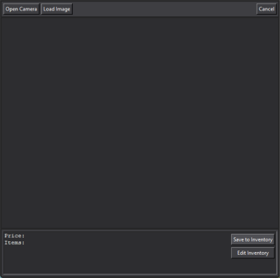
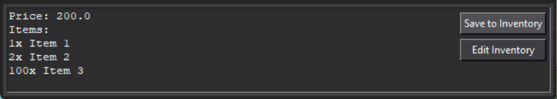
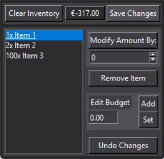

# __Snapventory__
Snapventory is a tkinter app that uses tesseract and computer vision with OpenCV to read receipts from a webcam or an existing file, and saves that data to an SQL database containing the current inventory and budget. The inventory can also be edited using a separate interface.

## Technologies
* __OpenCV:__ Image capture and editing
* __tkinter:__ GUI
* __tesseract:__ Parsing images to text
* __SQLite:__ Database (inventory)
* __PIL:__ Converting image format
* __RegEx:__ Finding patterns in strings

## Setup
Use the package manager pip to download the dependencies.
```bash
pip install -r ./requirements.txt
```

## Usage
On running the program (using main.py), the user will be met by this screen:

* __Open Camera:__ Opens main camera (webcam). Point it at the receipt and press SPACE to scan.
* __Load Image:__ Opens File Explorer. Select the preferred image, and press __Scan Image__ to scan.
* __Cancel:__ Clears the main display and the textbox at the bottom.

When the selected receipt has been scanned, the program will insert the read information into the textbox, which looks like this:
```
Price: [Price]
Items:

```
To enter items manually or correct the budget in case of an error, use this format:
```
Price: [Corrected price]
Items:
[Amount]x [Item]
[Amount]x [Item]
[Amount]x [Item]
etc.
```
For example,



Once the textbox contains the correct information, the user can save it to the inventory using the __Save to Inventory__ button on the right.

If the user wants to update the inventory at any point, the __Edit Inventory__ button will open the Edit Inventory interface:


The box in the center of the taskbar displays the budget.
* __Save Changes:__ Updates the inventory. All changes made before this can be reversed using the __Undo Changes__ button, or just by simply closing the window.
* __Clear Inventory:__ Removes all items from inventory.
* __Modify Amount By:__ Enter the amount of the selected item (in blue) that needs to be added/removed (use a negative value to remove)
* __Remove Item:__ Removes selected item.
* __Edit Budget:__ Enter a sum of money, and use either __Add__ to add it to the budget or __Set__ to set the budget to this value.